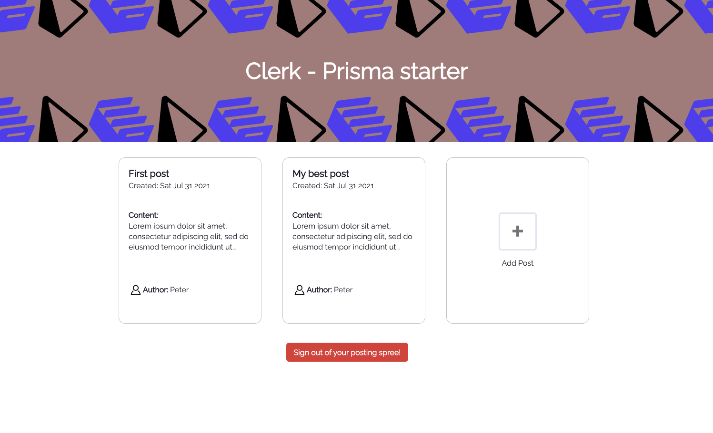

# Clerk - Prisma example repo

This repo shows an example use case for how you setup Prisma with [Clerk](https://clerk.dev) to achieve authenticated user access for your data.

## Starter Posts App

The **Starter Posts App** allows authenticated users to create posts in the Prisma MongoDB database. Each user can also delete his own posts.

## Under the hood

This example app uses:

- [Clerk](https://clerk.dev?utm_source=github&utm_medium=starters&utm_campaign=prisma) as an authentication provider.
- [Prisma](https://www.prisma.io/) for data storage.

## Where the magic happens

Authenticating Prisma data access using Clerk works by introducing a thin and customizable access management layer on top of the Prisma generated API for our collection.

- Authenticated resource [access requests](pages/api/posts/index.ts#11).
- Manage authenticated resource [modification requests](pages/api/posts/[id].ts#25).

### User authentication logic transparent from the client

Another point which seems a major benefit to most is that depending on the nature of the application, the access management logic and the email-attribute enhancement of the Prisma models, can happen fully on the server side transparently from the client code.

## Running the example

To run the example locally you need to:

1. Sign up for a Clerk account at [http://clerk.dev/](http://clerk.dev/?utm_source=github&utm_medium=starters&utm_campaign=prisma).
2. Clone this repository `git clone git@github.com:clerkinc/clerk-prisma-starter.git`.
3. Setup the required API variables from your Clerk project as shown at [the example env file](./.env.example).
4. `npm install` to install the required dependencies.
5. Setup your Prisma database, following the [instructions](./server/db/README.md) at the `db` folder.
6. `npm run dev` and you are good to go.

## Deploy to Heroku

## Contact

If you have any specific use case or anything you would like to ask, please reach out!
